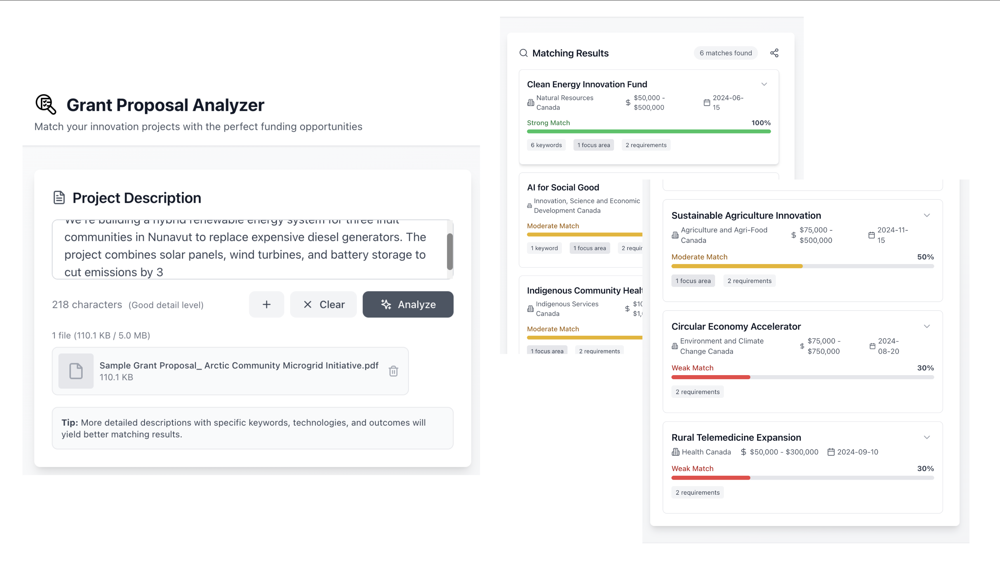

# 🎯 Grant Proposal Analyzer

An intelligent web application that matches project proposals with relevant grant opportunities using AI-powered analysis and semantic matching.



## 🌟 Features

- **Smart Matching Algorithm**: Analyzes project descriptions against grant criteria

- **Real-time Analysis**: Instant feedback on grant alignment strength

- **Visual Strength Meters**: Color-coded indicators (High/Medium/Low match)

- **Comprehensive Grant Database**: Pre-loaded with diverse funding opportunities

- **Clean Two-Panel Interface**: Intuitive input/output design

- **Detailed Grant Information**: Focus areas, funding amounts, deadlines, requirements, and contact details

- **File Upload Support**: Upload up to 3 proposal documents (PDF, DOCX, images, text) for better analysis.

- **LLM Integration**: Enhanced proposal analysis using Large Language Models (LLM) API integration.

- **Share Functionality**: Generate shareable links to share your analysis results with collaborators.


## 🚀 Live Demo

[View Live Demo](docs/videos/demo-video.mp4)
        

## 🛠️ Tech Stack

- **Frontend**: React 18

- **Styling**: Tailwind CSS

- **Icons**: Lucide React

- **Build Tool**: Create React App / Vite

- **Deployment**: GitHub Pages / Netlify

## 📦 Installation

### Prerequisites

- Node.js (v16 or higher)

- npm or yarn

### Setup

```bash

# Clone the repository

git clone https://github.com/15121connect/grant-proposal-analyzer.git

# Navigate to project directory

cd grant-proposal-analyzer

# Install dependencies

npm install

# Start development server

npm start

```

The application will open at `http://localhost:3000`

### Testing with Sample Data

A sample grant proposal PDF is included in the `resources/` folder for testing:

- **Sample File**: `resources/sample-grant-proposal.pdf` - Arctic Community Microgrid Initiative

You can upload this file using the file upload feature to test the application's document analysis capabilities.

## 🎮 Usage

1. **Enter Project Description**: Type or paste your project details in the left panel

   - Include key information: goals, methodology, target community, expected outcomes

   - More detail = better matching accuracy

2. **Upload Files (Optional)**: Click the plus (+) button to upload supporting documents

   - Upload up to 3 files (PDF, DOCX, images, text files)

   - Maximum total file size: 5MB

   - File content will be automatically extracted and included in the analysis

   - View file thumbnails and remove files as needed

3. **Analyze**: Click the "Analyze" button to process your proposal

4. **Review Results**: View matched grants sorted by alignment strength

   - Green (70%+): Strong match

   - Yellow (40-69%): Moderate match  

   - Red (<40%): Weak match

5. **Explore Grants**: Click on any grant card to expand and see full details including website and contact information

6. **Share Results**: Click the share icon next to the match count to generate a shareable link with your analysis results

## 📊 How It Works

The matching algorithm evaluates proposals across multiple dimensions:

- **Keyword Matching** (15 points per match): Technical and domain keywords

- **Focus Area Alignment** (20 points per match): Primary grant objectives

- **Requirement Coverage** (10 points per requirement): Proposal completeness

- **Detail Bonus** (up to 10 points): Length and depth of description

Maximum score: 100 points

See [METHODOLOGY.md](docs/METHODOLOGY.md) for detailed scoring logic.

## 🗂️ Project Structure

```

src/

├── components/              # React components

│   ├── InputPanel.jsx     # Left panel - text input and file upload

│   ├── ResultsPanel.jsx  # Right panel - grant results with share functionality

│   └── GrantCard.jsx     # Individual grant display with enhanced details

├── data/                  # Grant database

│   └── grantsDatabase.js  # Grant data with website and contact info

├── utils/                 # Utility functions

│   ├── matchingAlgorithm.js  # Core matching algorithm

│   └── llmService.js        # LLM API integration for enhanced analysis

├── assets/                # Static assets

│   └── analyzer-logo.png  # Application logo

├── resources/             # Sample files for testing

│   └── sample-grant-proposal.pdf  # Sample grant proposal PDF

└── App.jsx                # Main application component

```

## 🔧 Configuration

### Adding New Grants

Edit `src/data/grantsDatabase.js`:

```javascript

{

  id: 7,

  name: "Your Grant Name",

  funder: "Organization Name",

  amount: "$X - $Y",

  deadline: "YYYY-MM-DD",

  focus: ["area1", "area2"],

  keywords: ["keyword1", "keyword2"],

  requirements: ["req1", "req2"]

}

```

### Customizing Scoring

Modify weights in `src/utils/matchingAlgorithm.js`:

```javascript

const WEIGHTS = {

  KEYWORD_MATCH: 15,

  FOCUS_MATCH: 20,

  REQUIREMENT_MATCH: 10,

  DETAIL_BONUS: 5

};

```

### LLM API Configuration

To enable LLM-enhanced analysis, create a `.env` file in the project root:

```env

REACT_APP_LLM_API_URL=https://api.openai.com/v1/chat/completions

REACT_APP_LLM_API_KEY=your-api-key-here

```

The application will automatically use LLM enhancement when files are uploaded. If no API key is configured, the system falls back to basic text matching.

## 🚧 Roadmap

- [ ] Export results to PDF

- [ ] User accounts and saved proposals

- [ ] Grant deadline notifications

- [ ] Multi-language support

- [ ] Advanced LLM model selection and configuration

- [ ] Batch proposal analysis

## 🤝 Contributing

Contributions welcome! Please:

1. Fork the repository

2. Create a feature branch (`git checkout -b feature/AmazingFeature`)

3. Commit changes (`git commit -m 'Add AmazingFeature'`)

4. Push to branch (`git push origin feature/AmazingFeature`)

5. Open a Pull Request

## 📝 License

This project is licensed under the MIT License - see [LICENSE](LICENSE) file for details.

## 👤 Author

**Ola Oguntoye**

- Email: [15121connect@gmail.com](mailto:15121connect@gmail.com)

- GitHub: [@15121connect](https://github.com/15121connect)

## 🙏 Acknowledgments

- Grant data inspired by real Canadian funding programs

- Built as part of a data analytics portfolio

- Designed for mission-led innovation teams

## 📧 Contact

Questions or feedback? Open an issue or reach out at [15121connect@gmail.com](mailto:15121connect@gmail.com)

---

**Note**: This is a portfolio demonstration project. Grant data is simulated for educational purposes.

